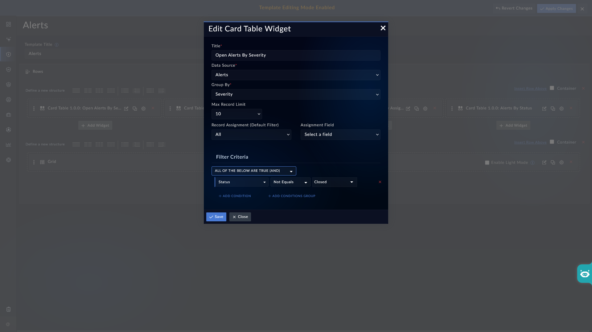

| [Home](../README.md) |
| -------------------- |

# Installation

1. In FortiSOAR, navigate to **Content Hub** > **Discover**.
2. From the list of widgets, search for **Card Table**.
3. Click the **Card Table** widget card.
4. Click **Install** at the bottom of the card to begin installation.

# Configuration

To configure the **Card Table** widget:

1. Navigate to the module's list view where you want to add the widget.
2. Click **Edit Template** to open the template editor.
3. Click **Add Widget** and select **Card Table** from the list.
4. The **Edit Card Table Widget** configuration form opens. Fill in the fields as described in the *Editing the Card Title Widget* section.

    

5. Click **Save** to apply the configuration.

## Editing the Card Title Widget

### Title

Enter a display name for the widget. This title appears in the widget header on the list view. For example, enter `Open Alerts By Severity` to identify the widget's purpose at a glance.

### Data Source

Select the FortiSOAR module whose records the widget will summarize. For example, select **Alerts** to display a grouped count of alert records.

### Group By

Select the field by which records are grouped. Each distinct value of this field appears as a row in the widget, with the count of matching records shown alongside it. For example, select **Severity** to see a breakdown of records by severity level.

### Max Record Limit

Set the maximum number of records to fetch when building the summary. The default value is **`10`**. Adjust this based on how many groups you expect and how many records you want included in the count.

### Record Assignment (Default Filter)

Select the assignment scope used to pre-filter records before applying any other filter criteria. Options include **All**, **Assigned to Me**, and similar scopes depending on your FortiSOAR configuration. This acts as a default filter on top of any conditions defined in the Filter Criteria section.

### Assignment Field

Select the field used to evaluate the record assignment scope defined above. This field is required when **Record Assignment** is set to a value other than **All**.

### Filter Criteria

Define conditions to restrict which records are included in the summary. The filter builder supports the following logic modes:

- **All of the below are true (AND)** — all defined conditions must be met for a record to be counted.
- **Any of the below are true (OR)** — at least one condition must be met.

Click **+ Add Condition** to add an individual field-level filter, or **+ Add Conditions Group** to create nested logical groups for more complex filtering.

## Next Steps

| [Usage](./usage.md) |
| ------------------- |
